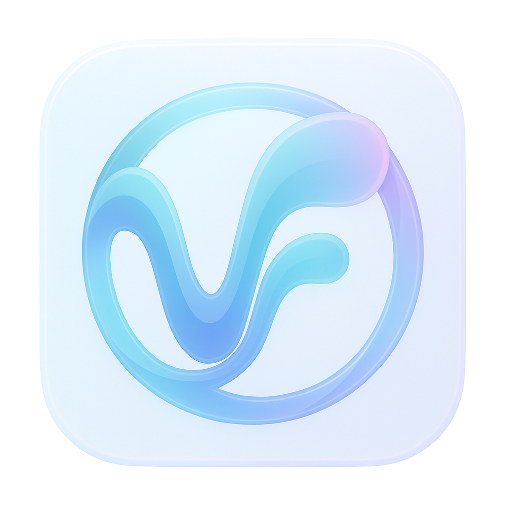

<p align="center">
  
</p>

<h1 align="center">VoiceFlow</h1>

<p align="center">
  <strong>Lightning-fast voice-to-text for macOS</strong><br>
  Hold Option+Space, speak, release to paste. It's that simple.
</p>

<p align="center">
  <a href="#features">Features</a> &bull;
  <a href="#installation">Installation</a> &bull;
  <a href="#usage">Usage</a> &bull;
  <a href="#voice-commands">Voice Commands</a> &bull;
  <a href="#building-from-source">Building</a>
</p>

---

## Features

- **Push-to-talk** &mdash; Hold `⌥ Space` to record, release to transcribe and paste
- **100% local** &mdash; All processing on-device with Metal GPU acceleration
- **Multiple STT engines** &mdash; [Moonshine](https://github.com/usefulsensors/moonshine) (ONNX), [Whisper](https://github.com/openai/whisper) (whisper.cpp), and [Qwen3-ASR](https://huggingface.co/Qwen/Qwen3-ASR-0.6B)
- **Multiple LLM backends** &mdash; [mistral.rs](https://github.com/EricLBuehler/mistral.rs) and [llama.cpp](https://github.com/ggerganov/llama.cpp) for wide model coverage
- **Smart formatting** &mdash; Automatic punctuation, capitalization, em-dashes, bullet lists
- **Number normalization** &mdash; "fifty thousand dollars" becomes "$50,000", "three thirty pm" becomes "3:30 PM", phone numbers, percentages, dates, and keyword numbers (port 8000) all converted automatically
- **Voice commands** &mdash; Say "new paragraph", "bullet point", "question mark" and more
- **Filler word removal** &mdash; "um", "uh", "hmm" removed automatically
- **Customizable dictionary** &mdash; Editable replacement file for technical terms and proper nouns
- **Context-aware** &mdash; Reads cursor context via Accessibility API for seamless spacing
- **Visual context (VLM)** &mdash; Uses a local vision-language model to capture and analyze your screen, extracting names, terms, and writing context to improve spelling accuracy. Supports Jina VLM and Qwen3-VL models
- **Per-app formatting** &mdash; Auto-detects apps (email, Slack, code editors, etc.) and lets you customize dictation style per application with custom prompts
- **Correction learning** &mdash; Learns from your edits to fix recurring spelling mistakes automatically, with 30-day history and pattern management
- **Voice snippets** &mdash; Create custom trigger phrases that expand into any text (e.g., "my signature" expands to your full sign-off)
- **Menu bar app** &mdash; Minimal footprint, no dock icon, launch at login

## How It Works

VoiceFlow supports two pipeline modes:

**STT + LLM (default)** &mdash; Separate speech-to-text and formatting stages:

```
Audio → STT Engine (Moonshine/Whisper) → Prosody Processing → LLM Formatting → Output
                                                                     ↑
                                              Visual Context (VLM) ──┤
                                              App Profile Prompt ────┤
                                              Correction History ────┘
```

**Consolidated** &mdash; A single model handles both transcription and formatting:

```
Audio → Qwen3-ASR (Python daemon) → Post-processing → Output
```

```
┌──────────────────────────────────────────────────────┐
│               macOS SwiftUI App                      │
│   Menu bar, hotkeys, audio recording, settings       │
└─────────────────┬────────────────────────────────────┘
                  │ FFI (C bindings)
┌─────────────────▼────────────────────────────────────┐
│            voiceflow-ffi                             │
│   C-compatible API, panic safety                     │
└─────────────────┬────────────────────────────────────┘
                  │
┌─────────────────▼────────────────────────────────────┐
│           voiceflow-core                             │
│                                                      │
│  Pipeline: Audio → STT → Prosody → LLM → Output     │
│                                                      │
│  STT Engines:         LLM Backends:    Prosody:      │
│  - Moonshine (ONNX)   - mistral.rs    - Voice cmds  │
│  - Whisper (cpp)       - llama.cpp     - Pause det.  │
│  - Qwen3-ASR (ext.)                   - Pitch det.  │
│                                        - Filler rem. │
│  Post-processing:                      - Replacements│
│  - Number normalization               - Spell concat │
│  - Abbreviation fixing                               │
│                                                      │
│  Smart Context:                                      │
│  - VLM visual context (Jina/Qwen3-VL)               │
│  - Per-app profiles                                  │
│  - Correction learning                               │
└──────────────────────────────────────────────────────┘
```

## Installation

### Requirements

- macOS 13.0 (Ventura) or later
- Apple Silicon (M1/M2/M3/M4) recommended for best performance

### Download

1. Download the latest `VoiceFlow.zip` from [Releases](https://github.com/Alexander-Ollman/voiceflow/releases)
2. Extract the ZIP and launch VoiceFlow — it will offer to move itself to Applications
3. Grant **Microphone** and **Accessibility** permissions when prompted


## Building from Source

### Prerequisites

- **Rust 1.70+** &mdash; Install via [rustup](https://rustup.rs/)
- **Xcode Command Line Tools** &mdash; `xcode-select --install`
- **Swift 5.9+** &mdash; Included with Xcode
- **For Qwen3-ASR mode**: Python 3.10+ with `pip install qwen-asr torch soundfile`

### Build

```bash
# Clone the repository
git clone https://github.com/Alexander-Ollman/voiceflow.git
cd voiceflow

# Build the Rust library
cargo build --release

# Build the macOS app
cd VoiceFlowApp
./build.sh

# Run
open build/VoiceFlow.app
```

### Download Models

```bash
# Download default models (Moonshine Base + Qwen3 1.7B)
cargo run -p voiceflow-cli -- setup

# Specify different models
cargo run -p voiceflow-cli -- setup --whisper base --llm qwen3-4b

# Download all models for benchmarking
cargo run -p voiceflow-cli -- setup --benchmark
```

## Usage

1. **Launch VoiceFlow** &mdash; Look for the icon in your menu bar
2. **Hold `⌥ Space`** &mdash; Start speaking
3. **Release `⌥ Space`** &mdash; Text is transcribed, formatted, and pasted at your cursor

### Status Indicator

The menu bar icon changes color to show status:

| Color | State |
|-------|-------|
| Default | Ready |
| Red | Recording |
| Yellow | Processing |

### Settings

Access settings from the menu bar icon. Configure your STT engine, LLM model, pipeline mode, and hotkey preferences. The **Style** tab lets you adjust formatting level, spacing, punctuation, visual context, per-app profiles, and view your correction history.

## CLI Reference

The CLI provides full access to VoiceFlow's capabilities:

```bash
cargo run -p voiceflow-cli -- <command>
```

| Command | Description | Key Flags |
|---------|-------------|-----------|
| `record` | Record from microphone and transcribe | `--clipboard`, `--context <type>`, `--raw` |
| `file <path>` | Transcribe an audio file | `--context <type>`, `--raw` |
| `setup` | Download required models | `--whisper <size>`, `--llm <model>`, `--benchmark` |
| `config show` | Show current configuration | |
| `config set-model <model>` | Set the LLM model | |
| `config set-whisper <size>` | Set the Whisper model size | |
| `config set-mode <mode>` | Set pipeline mode | `stt-plus-llm` or `consolidated` |
| `config set-consolidated-model <model>` | Set the consolidated model | `qwen3-asr-0.6b` or `qwen3-asr-1.7b` |
| `config add-word <word>` | Add to personal dictionary | |
| `config path` | Show config file path | |
| `bench` | Run performance benchmark | `--iterations <n>`, `--file <path>` |
| `eval` | Evaluate transcription quality (LibriSpeech) | `--limit <n>`, `--samples`, `--raw`, `--analyze`, `--stt <model>`, `--llm <model>`, `--benchmark` |
| `models` | List available models | |

All commands support `--verbose` for debug output and `--config <path>` for a custom config file.

## Voice Commands

### Punctuation

| Say | Output |
|-----|--------|
| "period" / "full stop" | `.` |
| "comma" | `,` |
| "question mark" | `?` |
| "exclamation mark" / "bang" | `!` |
| "colon" | `:` |
| "semicolon" | `;` |
| "ellipsis" / "dot dot dot" | `...` |

### Formatting

| Say | Output |
|-----|--------|
| "new line" / "line break" | Line break |
| "new paragraph" | Paragraph break |
| "open quote" / "close quote" | `"` |
| "apostrophe" | `'` |
| "dash" / "em dash" | `—` |
| "hyphen" | `-` |

### Brackets & Grouping

| Say | Output |
|-----|--------|
| "open paren" / "close paren" | `(` `)` |
| "open bracket" / "close bracket" | `[` `]` |
| "open brace" / "close brace" | `{` `}` |

### Special Characters

| Say | Output |
|-----|--------|
| "ampersand" | `&` |
| "at sign" | `@` |
| "hashtag" / "hash" | `#` |
| "dollar sign" | `$` |
| "percent" | `%` |
| "asterisk" / "star" | `*` |
| "underscore" | `_` |
| "slash" / "forward slash" | `/` |
| "backslash" | `\` |

### Programming

| Say | Output |
|-----|--------|
| "equals" | `=` |
| "plus" | `+` |
| "minus" | `-` |
| "greater than" | `>` |
| "less than" | `<` |
| "pipe" | `\|` |
| "tilde" | `~` |
| "caret" | `^` |

### Automatic Features

- **Punctuation** &mdash; Added automatically based on speech patterns
- **Capitalization** &mdash; Sentences capitalized after punctuation
- **Number normalization** &mdash; Currency ($50,000), percentages (25%), times (3:30 PM), phone numbers (555-123-4567), dates (January 15), and keyword numbers (port 8000) converted automatically. Small numbers (one through nine) stay spelled out per style convention
- **Abbreviations** &mdash; "doctor Smith" becomes "Dr. Smith", "follow up appointment" becomes "follow-up appointment"
- **Lists** &mdash; Enumerated items converted to bullet points
- **Em-dashes** &mdash; Mid-sentence pauses become `—` dashes
- **Filler removal** &mdash; "um", "uh", "ah", "hmm", "er" removed
- **Spelled-out words** &mdash; "S M O L L M" becomes "SMOLLM"
- **Technical terms** &mdash; Configurable replacement dictionary (e.g., "G P T" &rarr; "GPT")

## Smart Context

VoiceFlow uses three complementary systems to improve accuracy over time:

- **Visual context (VLM)** &mdash; When enabled, captures a screenshot of your active window and uses a local vision-language model (Jina VLM or Qwen3-VL) to extract names, terms, and writing context. This helps the LLM spell proper nouns correctly &mdash; names visible on screen, project names in code editors, technical terms in documentation. Screenshots are compressed locally (JPEG, max 1280x720) and never leave your machine. Requires a VLM model download and Screen Recording permission.

- **Per-app formatting** &mdash; VoiceFlow auto-detects the frontmost application and adjusts formatting style. Email apps (Outlook, Apple Mail, Gmail) get professional tone, chat apps (Slack, Discord, Teams) get casual formatting with emoji support, and code editors (VS Code, Cursor, Xcode) preserve technical precision. VoiceFlow auto-creates a profile the first time it sees a new app. Customize any app's formatting prompt in Settings > Style > App Profiles.

- **Correction learning** &mdash; After dictating, VoiceFlow monitors for edits to the pasted text. When you correct a word (e.g., fixing "kunal" to "Kunal"), VoiceFlow learns the pattern and applies it to future dictations automatically. Patterns are retained for 30 days (max 100). View and manage learned corrections in Settings > Style > Correction History.

All three systems feed context into the LLM formatting stage, working together for increasingly accurate output.

## Supported Models

### STT Engines

**Moonshine** (ONNX Runtime &mdash; default):

| Model | Parameters | Size | Notes |
|-------|-----------|------|-------|
| Moonshine Tiny | 27M | ~190 MB | Fastest |
| Moonshine Base | 62M | ~400 MB | Default, best balance |

**Whisper** (whisper.cpp):

| Model | Parameters | Size | Expected WER |
|-------|-----------|------|-------------|
| Tiny | 39M | 75 MB | ~7.5% |
| Base | 74M | 142 MB | ~5.0% |
| Small | 244M | 466 MB | ~4.2% |
| Medium | 769M | 1.5 GB | ~3.5% |
| Large V3 | 1.5B | 3.0 GB | ~2.9% |
| Large V3 Turbo | 809M | 1.6 GB | ~3.0% |
| Distil-Large V3 | 756M | 1.5 GB | ~3.5% |

**Qwen3-ASR** (Python daemon, consolidated mode):

| Model | Parameters | Size |
|-------|-----------|------|
| Qwen3-ASR 0.6B | 0.6B | ~1.2 GB |
| Qwen3-ASR 1.7B | 1.7B | ~3.4 GB |

### LLM Models

| Model | Backend | Size (Q4_K_M) | License |
|-------|---------|---------------|---------|
| Qwen3 1.7B | mistral.rs | 1.3 GB | Apache 2.0 |
| Qwen3 4B | mistral.rs | 2.5 GB | Apache 2.0 |
| SmolLM3 3B | llama.cpp | 1.9 GB | Apache 2.0 |
| Gemma 2 2B | mistral.rs | 1.7 GB | Gemma |
| Gemma 3n E2B | llama.cpp | 1.8 GB | Gemma |
| Gemma 3n E4B | llama.cpp | 3.2 GB | Gemma |
| Phi-4 Mini 3.8B | llama.cpp | 2.4 GB | MIT |
| Phi-2 | mistral.rs | 1.6 GB | MIT |

Custom GGUF models are also supported via `llama.cpp`.

### VLM Models (Visual Context)

| Model | Size | Notes |
|-------|------|-------|
| Jina VLM | ~9.9 GB | Default, best quality |
| Qwen3-VL 2B Instruct | ~4.3 GB | Lighter alternative |

## Configuration

VoiceFlow stores its configuration in a TOML file:

```
~/Library/Application Support/com.era-laboratories.voiceflow/config.toml
```

### Key Settings

```toml
# Pipeline mode: "stt-plus-llm" (default) or "consolidated"
pipeline_mode = "stt-plus-llm"

# STT engine: "moonshine" (default), "whisper", or "qwen3-asr"
stt_engine = "moonshine"
moonshine_model = "base"
whisper_model = "base"

# Consolidated mode model (used when pipeline_mode = "consolidated")
consolidated_model = "qwen3-asr-0-6b"

# LLM model for formatting
llm_model = "qwen3-1-7b"

# LLM generation parameters
[llm_options]
max_tokens = 512
temperature = 0.3
top_p = 0.9
n_gpu_layers = -1
enable_thinking = false

# Audio settings
[audio]
sample_rate = 44100
vad_threshold = 0.01
silence_duration_ms = 800

# Default context for formatting
default_context = "default"

# Auto-copy to clipboard
auto_clipboard = true
```

### Context Types

Context types are auto-detected based on the frontmost application and can be customized per app in Settings > Style > App Profiles.

| Context | Behavior |
|---------|----------|
| `default` | General dictation with standard formatting |
| `email` | Email-appropriate tone and structure |
| `slack` | Casual, chat-style formatting |
| `code` | Code-aware formatting, preserves technical terms |

### Environment Variable Overrides

All settings can be overridden via environment variables prefixed with `VOICEFLOW_`:

```bash
VOICEFLOW_STT_ENGINE=whisper
VOICEFLOW_LLM_MODEL=qwen3-4b
VOICEFLOW_PIPELINE_MODE=consolidated
VOICEFLOW_LLM_TEMPERATURE=0.5
```

### File Paths

| Path | Contents |
|------|----------|
| `~/Library/Application Support/com.era-laboratories.voiceflow/config.toml` | Configuration |
| `~/Library/Application Support/com.era-laboratories.voiceflow/models/` | Downloaded ML models |
| `~/Library/Application Support/com.era-laboratories.voiceflow/prompts/` | Custom prompt templates |

## Project Structure

```
voiceflow/
├── crates/
│   ├── voiceflow-core/          # Core Rust library
│   │   ├── src/
│   │   │   ├── config.rs        # Configuration management
│   │   │   ├── pipeline.rs      # Main processing pipeline
│   │   │   ├── llm/             # LLM inference (mistral.rs + llama.cpp backends)
│   │   │   ├── transcribe/      # STT engines (Whisper, Moonshine)
│   │   │   ├── prosody/         # Voice commands, filler removal, pauses, pitch
│   │   │   └── audio/           # Audio capture and resampling
│   │   └── Cargo.toml
│   ├── voiceflow-cli/           # Command-line interface
│   │   └── src/commands/        # record, file, setup, config, bench, eval
│   └── voiceflow-ffi/           # C FFI for Swift bindings
├── VoiceFlowApp/                # macOS SwiftUI application
│   ├── Sources/VoiceFlowApp/    # Swift UI, audio recording, hotkeys
│   └── build.sh                 # App bundle build script
├── prompts/                     # LLM system prompts & replacement dictionary
│   ├── default.txt              # Default formatting prompt
│   └── replacements.toml        # Customizable word replacements
├── scripts/
│   └── qwen3_asr_daemon.py      # Python daemon for Qwen3-ASR
└── Cargo.toml                   # Workspace configuration
```

## Contributing

See [CONTRIBUTING.md](CONTRIBUTING.md) for development setup, architecture details, and guidelines.

## License

MIT License &mdash; [Alex Ollman](https://github.com/Alexander-Ollman) 2025

See [LICENSE](LICENSE) for details.

---

<p align="center">
  Made with care for fast typists who'd rather talk
</p>
